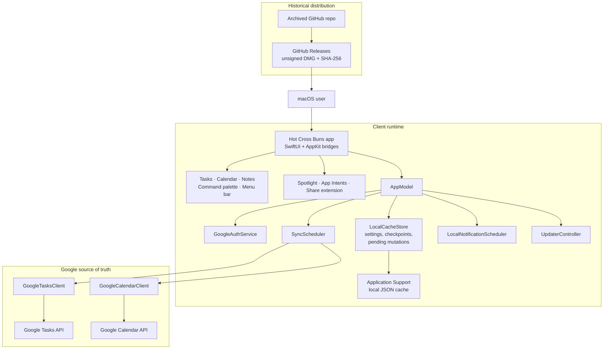

<p align="center">
  <a href="https://github.com/gongahkia/hot-cross-buns">
    
  </a>
</p>

<h1 align="center">Hot Cross Buns</h1>

<h3 align="center">Keyboard-first planning for macOS, backed by Google Tasks and Google Calendar.</h3>

<p align="center">
  <a href="https://github.com/gongahkia/hot-cross-buns/releases/latest">Release Archive</a> ·
  <a href="apps/apple/README.md">Apple App</a> ·
  <a href="docs/mcp.md">MCP</a> ·
  <a href="reference/architecture/ARCHITECTURE.md">Architecture</a>
</p>

<p align="center">
  <a href="https://github.com/gongahkia/hot-cross-buns/releases/latest/download/HotCrossBuns-macOS.dmg">
    
  </a>
</p>

<p align="center">
  <a href="https://github.com/gongahkia/hot-cross-buns/releases/latest">
    
  </a>
  
  
</p>

> [!NOTE]
> This repository was archived on 2026-06-10. GitHub Pages, CI, issue tracking, and active release work are disabled. The code and docs remain as historical reference.

> [!IMPORTANT]
> Public downloads currently ship as an unsigned DMG. On first launch, macOS may ask the user to allow the app once from `System Settings > Privacy & Security > Open Anyway`.

## Table of Contents

- [Highlights](#highlights)
- [Demo](#demo)
- [Install](#install)
- [Archived Status](#archived-status)
- [Architecture](#architecture)
- [Repository Layout](#repository-layout)
- [Build From Source](#build-from-source)
- [Historical Release Artifacts](#historical-release-artifacts)
- [Testing](#testing)
- [Additional Documentation](#additional-documentation)

## Highlights

Hot Cross Buns is a native Mac planner built around three everyday surfaces:

- Tasks for inbox capture and day-to-day execution, synced with Google Tasks
- Calendar views for agenda, day, week, month, and longer-range planning, synced with Google Calendar
- Lightweight local notes for context, drafts, and reference material

Around those core surfaces, the app also includes:

- Command palette capture and keyboard-first navigation
- Leader-key shortcuts for diagnostics, help, refresh, and secondary actions
- menu bar surfaces for glanceable calendar, compact capture, and fast return to the main app
- Spotlight indexing and App Shortcuts integration
- Optional local MCP server for user-configured AI agent clients
- Local cache, sync checkpoints, and pending offline mutations
- Diagnostics, recovery tools, and local reminder scheduling

## Demo

<div align="center">
  <video src="https://github.com/user-attachments/assets/ea15df17-b65f-4f2e-b6f2-a6fec0fe5490" controls muted playsinline preload="metadata"></video>
</div>

## Install

**Historical downloads**

- DMG: `https://github.com/gongahkia/hot-cross-buns/releases/latest/download/HotCrossBuns-macOS.dmg`
- Release page: `https://github.com/gongahkia/hot-cross-buns/releases/latest`

**First launch on macOS**

1. Open the app once after dragging it into `Applications`.
2. If macOS blocks it, go to `System Settings > Privacy & Security`.
3. Click `Open Anyway`.

You should only need to do that once per Mac.

## Archived Status

- This repository is archived and no longer maintained.
- GitHub Pages and the one-line installer have been disabled.
- All open GitHub issues were closed during archival.
- `apps/apple` is the final product path. Older Tauri and self-hosted sync-server work has been removed from the repo.
- Google Tasks and Google Calendar are the source of truth.
- Google OAuth is bring-your-own-client. Downloaded DMGs can use a user-supplied Google Cloud Desktop OAuth client at runtime; source builds can still embed a native Google Sign-In client.
- Historical GitHub Releases use the stable DMG alias: `HotCrossBuns-macOS.dmg`.
- The public path ended as an unsigned DMG release flow, not a signed/notarized consumer release.

## Architecture



## Build From Source

**Requirements**

- macOS 14+
- Xcode 15+
- `xcodegen`

**Generate the Xcode project**

```bash
cd apps/apple
xcodegen generate
```

**Build**

```bash
xcodebuild -project HotCrossBuns.xcodeproj -scheme HotCrossBunsMac -destination 'platform=macOS' build CODE_SIGNING_ALLOWED=NO
```

**Run tests**

```bash
xcodebuild -project HotCrossBuns.xcodeproj -scheme HotCrossBunsMac -destination 'platform=macOS' test CODE_SIGNING_ALLOWED=NO
```

**Package an unsigned DMG locally**

```bash
scripts/package-macos-dmg.sh
```

**Google Cloud OAuth setup**

There are two supported Google OAuth paths.

**Path A: downloaded DMG + runtime Desktop OAuth**

Downloaded DMGs do not need to be rebuilt for personal Google sync:

1. Create a Google Cloud project.
2. Enable the Google Tasks API and Google Calendar API.
3. Configure the Google Auth platform / OAuth consent screen. For a personal Gmail account, choose `External`; add your Google account as a test user while setting up.
4. Create a `Desktop app` OAuth client.
5. Open Hot Cross Buns, paste the desktop client ID and optional client secret into the Google OAuth client setup card, then click Connect Google.

For personal day-to-day use, set the OAuth app publishing status to `In production` after setup. Google's testing status issues refresh tokens that expire after 7 days for the Tasks and Calendar scopes, so staying in testing means periodic re-consent.

**Path B: source build + embedded native Google Sign-In**

To embed a native Google Sign-In client in a source build instead, copy `apps/apple/Configuration/GoogleOAuth.example.xcconfig` to `apps/apple/Configuration/GoogleOAuth.local.xcconfig` and fill in your own iOS/macOS OAuth client values. The committed `apps/apple/Configuration/GoogleOAuth.xcconfig` provides blank CI-safe defaults and includes the local override when present.

```xcconfig
GOOGLE_MACOS_CLIENT_ID = your-client-id.apps.googleusercontent.com
GOOGLE_MACOS_REVERSED_CLIENT_ID = com.googleusercontent.apps.your-reversed-client-id
GOOGLE_MAPS_EMBED_API_KEY =
```

Do not distribute a build that embeds your personal native OAuth client for other people's accounts.

## Historical Release Artifacts

No release flow is maintained after archival. Existing GitHub Release assets remain historical downloads.

## Testing

The current suite is strongest on pure logic and sync-domain behavior:

- search and parsing
- recurrence and date handling
- bulk task operations
- local cache persistence
- sync tombstone handling
- calendar grid and drag/drop computations
- transport-level Google Tasks client behavior
- GitHub release updater behavior

The CI workflow was removed during archival. The commands above remain available for local verification.

## Additional Documentation

- [Apple app README](apps/apple/README.md)
- [Local MCP agent access](docs/mcp.md)
- [Architecture reference](reference/architecture/ARCHITECTURE.md)
