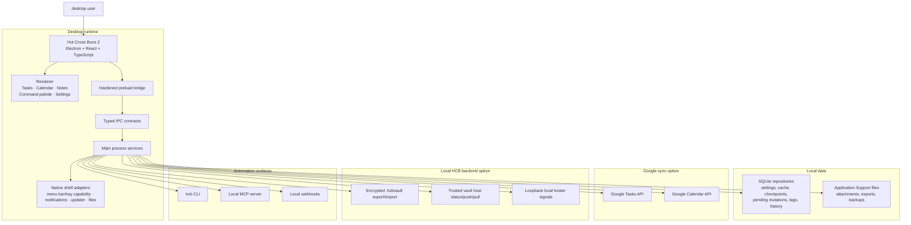

<p align="center">
  <a href="https://github.com/gongahkia/hot-cross-buns-2">
    
  </a>
</p>

<h1 align="center">Hot Cross Buns 2</h1>

<h3 align="center">Keyboard-first desktop planner for Google Tasks, Google Calendar, local HCB vaults, and terminal workflows on macOS, Linux, and Windows.</h3>

<p align="center">
  <a href="https://gongahkia.github.io/hot-cross-buns-2/">Website</a> ·
  <a href="docs/README.md">Docs</a> ·
  <a href="docs/mcp.md">MCP</a> ·
  <a href="docs/architecture/system-architecture.md">Architecture</a>
</p>

<p align="center">
  <a href="https://github.com/gongahkia/hot-cross-buns-2/releases/latest/download/Hot-Cross-Buns-2-macOS.dmg">
    
  </a>
  <a href="https://github.com/gongahkia/hot-cross-buns-2/releases/latest/download/Hot-Cross-Buns-2-linux-x64.AppImage">
    
  </a>
  <a href="https://github.com/gongahkia/hot-cross-buns-2/releases/latest/download/Hot-Cross-Buns-2-windows-x64.exe">
    
  </a>
</p>

<p align="center">
  <a href="https://github.com/gongahkia/hot-cross-buns-2/releases/latest">
    
  </a>
  
  
  
  
</p>

> [!IMPORTANT]
> Downloads are unsigned. macOS may require `System Settings > Privacy & Security > Open Anyway` on first launch, Windows may show SmartScreen warnings, and Linux tray/status-area surfaces, deep links, notifications, global shortcuts, and autostart are intentionally unsupported.

## Table of Contents

- [Highlights](#highlights)
- [Install](#install)
- [Architecture](#architecture)
- [Repository Layout](#repository-layout)
- [Local Development](#local-development)
- [Release Checks](#release-checks)
- [Testing](#testing)
- [Additional Documentation](#additional-documentation)

## Highlights

Hot Cross Buns 2 is an Electron-first desktop planner built around three everyday surfaces:

- Tasks for inbox capture and day-to-day execution, synced with Google Tasks or kept in local HCB storage
- Calendar views for agenda, day, week, multi-day, month, year, and longer-range planning, synced with Google Calendar or kept in local HCB storage
- Notes backed by task data for context, drafts, and reference material

Around those core surfaces, the app also includes:

- Command palette capture and keyboard-first navigation
- Account workspaces for multiple Google accounts
- Smart rescheduling, task/event/note conversion, reminders, recurrence, templates, and saved views
- Native shell surfaces where supported, including macOS menu bar panels for glanceable calendar, compact capture, and fast return to the main app
- Local customization with CSS snippets, keymaps, extension panels, custom backgrounds, and inferred color themes
- Portable `.hcbexport` archives, encrypted `.hcbvault` archives, trusted vault-host status/push/pull from Settings or CLI, saved vault-host credentials for Refresh/scheduled sync, local attachments, ICS import/subscription support, and local report exports
- Optional local MCP server, local hoster signal server, CLI/TUI, webhook, and dry-run/write-policy surfaces for user-configured agent clients
- Typed IPC, hardened preload bridge, diagnostics, recovery tools, and native capability reporting

## Install

**Downloads**

- macOS DMG: `https://github.com/gongahkia/hot-cross-buns-2/releases/latest/download/Hot-Cross-Buns-2-macOS.dmg`
- Linux AppImage: `https://github.com/gongahkia/hot-cross-buns-2/releases/latest/download/Hot-Cross-Buns-2-linux-x64.AppImage`
- Windows NSIS: `https://github.com/gongahkia/hot-cross-buns-2/releases/latest/download/Hot-Cross-Buns-2-windows-x64.exe`
- Release page: `https://github.com/gongahkia/hot-cross-buns-2/releases/latest`
- macOS one-line installer:

```bash
curl -fsSL https://gongahkia.github.io/hot-cross-buns-2/install-macos-preview.sh | bash
```

**First launch on macOS**

1. Open the app once after dragging it into `Applications`.
2. If macOS blocks it, go to `System Settings > Privacy & Security`.
3. Click `Open Anyway`.

You should only need to do that once per Mac.

**First launch on Linux**

The Linux package is an x64 AppImage.

```bash
curl -LO https://github.com/gongahkia/hot-cross-buns-2/releases/latest/download/Hot-Cross-Buns-2-linux-x64.AppImage
curl -LO https://github.com/gongahkia/hot-cross-buns-2/releases/latest/download/SHASUMS256.txt
sha256sum -c SHASUMS256.txt --ignore-missing
chmod +x Hot-Cross-Buns-2-linux-x64.AppImage
./Hot-Cross-Buns-2-linux-x64.AppImage
```

Known Linux limits:

- AppImage is the only Linux package format.
- The app can check GitHub Releases for newer AppImage builds, but does not download or install Linux updates automatically.
- Tray/status-area surfaces, `hotcrossbuns://` deep links, open-at-login/autostart, local notifications, and global shortcuts are unsupported on Linux.
- Google OAuth tokens, OAuth client secrets, and MCP bearer tokens require an OS-backed Secret Service provider such as GNOME Keyring/libsecret or KWallet. Plaintext fallback is rejected.

**First launch on Windows**

Download `Hot-Cross-Buns-2-windows-x64.exe`, verify it against `SHASUMS256.txt`, then run the NSIS installer. The installer is unsigned, so Windows or the browser may show trust warnings.

**Google Cloud OAuth setup**

Downloads use a bring-your-own Google Cloud Desktop OAuth client:

1. Create a Google Cloud project.
2. Enable the Google Tasks API and Google Calendar API.
3. Configure the OAuth consent screen. For personal use, add your Google account as a test user while setting up.
4. Create a `Desktop app` OAuth client.
5. Open Hot Cross Buns 2, paste the desktop client ID and optional client secret into setup, then connect Google.

Tokens are stored in macOS Keychain on macOS. On Linux, tokens are stored through Electron `safeStorage` only when backed by an OS credential provider such as GNOME Keyring/libsecret or KWallet. On Windows, tokens are stored through Electron `safeStorage`.

Do not distribute a build that embeds your personal OAuth client for other people's accounts.

## Architecture



## Repository Layout

```text
src/main/          Electron main process, native adapters, SQLite repositories, services
src/preload/       Narrow preload bridge over typed IPC contracts
src/renderer/      React app shell, planner surfaces, settings, command palette
src/shared/        Shared schemas, contracts, catalogs, sync/search helpers
docs/              Website, product docs, architecture, release, security, QA docs
scripts/           Local CLI, smoke, release, and packaging helpers
```

Start with [docs/README.md](docs/README.md) before changing product, architecture, security, or subsystem behavior.

## Local Development

**Requirements**

- macOS 14+
- Linux x64 AppImage, with Secret Service provider required for credentials
- Windows x64 NSIS installer
- Node 20+
- pnpm 9.15.4 through Corepack

**Install and run**

```bash
corepack enable
corepack prepare pnpm@9.15.4 --activate
pnpm install
pnpm dev
```

**Useful commands**

```bash
pnpm typecheck
pnpm test
pnpm test:smoke
pnpm hcb --help
```

## Release Checks

Packages are unsigned. macOS packages are also unnotarized.

```bash
pnpm release:mac:preview
pnpm release:linux:preview
pnpm release:smoke-appimage
HCB_APPIMAGE_SMOKE_LAUNCH=1 pnpm release:smoke-appimage
pnpm release:win:preview
pnpm release:smoke-nsis
```

Manual GitHub Actions gates:

- `Linux AppImage Preview Validation`
- `Windows Preview Validation`

Useful docs:

- [Distribution](docs/release/distribution.md)
- [Release Candidate Checklist](docs/release/release-candidate-checklist.md)
- [Mac Preview Support](docs/support/mac-preview-support.md)
- [Linux Preview Support](docs/support/linux-preview-support.md)
- [Manual Linux Native Shell Checklist](docs/testing/manual-linux-native-shell.md)
- [Privacy and Threat Model](docs/security/privacy-and-threat-model.md)

## Testing

The current suite covers:

- typed IPC contract validation
- SQLite repository and domain-service behavior
- Google Tasks and Google Calendar sync paths
- local search, semantic search, tags, templates, and automation flows
- renderer workflows for Tasks, Calendar, Notes, Settings, command palette, and onboarding
- native shell adapter contracts and release-support paths
- smoke, perf, and release-artifact scripts

Run focused tests with:

```bash
pnpm vitest run --config vitest.config.ts path/to/test.ts
```

## Additional Documentation

- [Docs index](docs/README.md)
- [System architecture](docs/architecture/system-architecture.md)
- [Tech stack](docs/architecture/tech-stack.md)
- [Google sync spec](docs/specs/google-sync.md)
- [Local data spec](docs/specs/local-data.md)
- [MCP agent access](docs/specs/mcp-agent-access.md)
- [HCB CLI](docs/hcb-cli.md)
- [Local hoster protocol](docs/specs/local-hoster.md)
- [Customization](docs/customization/theming.md)
- [Portable export](docs/portable-export.md)
- [QA plan](docs/testing/qa-plan.md)
