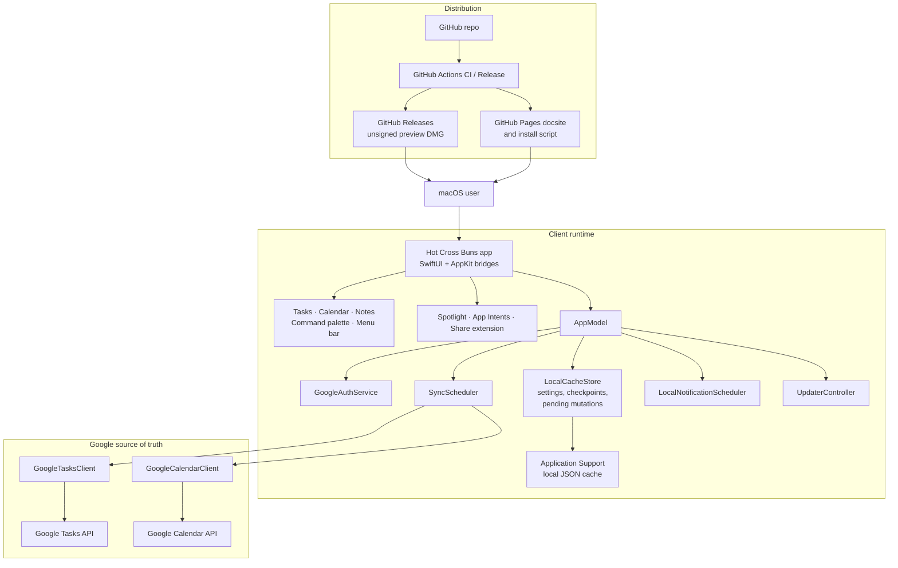

# Hot Cross Buns

Keyboard-first planner for macOS, backed by Google Tasks and Google Calendar.

[Website](https://gongahkia.github.io/hot-cross-buns/) · [Latest release](https://github.com/gongahkia/hot-cross-buns/releases/latest) · [Download preview DMG](https://github.com/gongahkia/hot-cross-buns/releases/latest/download/HotCrossBuns-macOS.dmg)

## Demo

<video src="https://gongahkia.github.io/hot-cross-buns/media/hero-window.mp4" controls muted playsinline preload="metadata"></video>

If the embedded video does not render in your GitHub client, open the [hero demo](https://gongahkia.github.io/hot-cross-buns/media/hero-window.mp4) or the [full docsite](https://gongahkia.github.io/hot-cross-buns/).

## What It Does

Hot Cross Buns is a Mac-only native planner with three primary surfaces:

- Tasks for inbox capture and day-to-day execution, synced with Google Tasks
- Calendar views for agenda, day, week, month, and longer-range planning, synced with Google Calendar
- Lightweight local notes for context, drafts, and reference material

Around those three surfaces, the app also includes:

- command palette capture and keyboard-first navigation
- leader-key shortcuts for diagnostics, help, refresh, and secondary actions
- three menu bar surfaces for glanceable calendar, compact capture, and fast return to the main app
- Spotlight indexing and App Shortcuts integration
- local cache, sync checkpoints, and pending offline mutations
- diagnostics, recovery tools, and local reminder scheduling
- unsigned preview DMG releases on GitHub

## Current Product Status

- `apps/apple` is the canonical product. Older Tauri and self-hosted sync-server work has been removed from the active repo path.
- Google Tasks and Google Calendar are the source of truth.
- The public download path is currently an unsigned preview DMG, not a signed/notarized consumer release.
- Preview builds should be treated as manual-update installs. Sparkle is still reserved for the future signed release path.

## Install

Direct download:

- DMG: `https://github.com/gongahkia/hot-cross-buns/releases/latest/download/HotCrossBuns-macOS.dmg`
- Release page: `https://github.com/gongahkia/hot-cross-buns/releases/latest`

One-line terminal install:

```bash
curl -fsSL https://gongahkia.github.io/hot-cross-buns/install-macos-preview.sh | bash
```

The installer downloads the latest preview DMG from GitHub Releases and installs the app into `/Applications` or `~/Applications`.

Because the preview build is unsigned, macOS may block the first launch. If that happens:

1. Open Hot Cross Buns once.
2. Go to `System Settings > Privacy & Security`.
3. Click `Open Anyway`.

You should only need to do that once per Mac.

## Architecture



## Repository Layout

```text
hot-cross-buns/
  apps/apple/          macOS SwiftUI app, tests, and XcodeGen project spec
  docs/                marketing site, release install script, appcast assets
  scripts/             build and packaging helpers
  .github/workflows/   CI and release automation
  reference/           historical architecture and planning notes
  schema/              historical schema artifacts from the older prototype
```

## Build From Source

Prerequisites:

- macOS 14+
- Xcode 15+
- `xcodegen`

Generate the Xcode project:

```bash
cd apps/apple
xcodegen generate
```

Build from the CLI:

```bash
xcodebuild -project HotCrossBuns.xcodeproj -scheme HotCrossBunsMac -destination 'platform=macOS' build CODE_SIGNING_ALLOWED=NO
```

Run tests from the CLI:

```bash
xcodebuild -project HotCrossBuns.xcodeproj -scheme HotCrossBunsMac -destination 'platform=macOS' test CODE_SIGNING_ALLOWED=NO
```

Package an unsigned DMG locally:

```bash
scripts/package-macos-dmg.sh
```

To run the app locally from Xcode with Google sign-in enabled, copy `apps/apple/Configuration/GoogleOAuth.example.xcconfig` to `apps/apple/Configuration/GoogleOAuth.local.xcconfig` and fill in your own values. The committed `apps/apple/Configuration/GoogleOAuth.xcconfig` provides blank CI-safe defaults and automatically includes the local override when present.

## Release Flow

- Push a tag matching `v*` to trigger `.github/workflows/release.yml`.
- The release workflow builds a DMG even when no Developer ID secrets are configured.
- Tag-based public releases require GitHub Actions secrets `GOOGLE_MACOS_CLIENT_ID` and `GOOGLE_MACOS_REVERSED_CLIENT_ID` so downloaded builds can complete Google sign-in.
- `GOOGLE_MAPS_EMBED_API_KEY` is optional for releases. When omitted, the app falls back to MapKit instead of the embedded Google Maps iframe.
- It now publishes a stable latest-download asset name: `HotCrossBuns-macOS.dmg`.
- The website download button and the one-line installer both target that stable latest-release asset.

## Testing

The current suite is strongest on pure logic and sync-domain behavior:

- search and parsing
- recurrence and date handling
- bulk task operations
- local cache persistence
- sync tombstone handling
- calendar grid and drag/drop computations
- transport-level Google Tasks client behavior

CI now builds and runs the macOS test suite on every push and pull request.

The next highest-value gaps are the Google Calendar transport layer, local notification scheduling edge cases, Google auth configuration and error paths, updater configuration gates, and App Intent routing.

## Additional Documentation

- [Apple app README](apps/apple/README.md)
- [Contributing](docs/CONTRIBUTING.md)
- [Architecture reference](reference/architecture/ARCHITECTURE.md)
- [Docsite](https://gongahkia.github.io/hot-cross-buns/)
