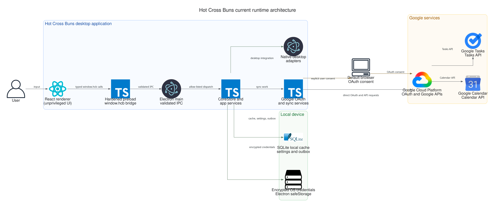

[](https://github.com/gongahkia/hot-cross-buns/releases/tag/1.0.0) 


# `Hot Cross Buns` 🍞

A keyboard-first [Desktop Planner](#architecture) for [Google Calendar](https://calendar.google.com/calendar/) and [Tasks](https://tasks.google.com/tasks/).

## Stack

* Frontend: [React](https://react.dev/), [TypeScript](https://www.typescriptlang.org/), [Electron](https://www.electronjs.org/), ...
* Backend: [Node.js](https://nodejs.org/en), ...
* Tests: ...
* Package: [Corepack](https://www.npmjs.com/package/corepack), [pnpm](https://pnpm.io/), ...

## Features

* In-app browser view
* Split-pane workspaces
* 50 curated colorschemes 
* Keyboard-first navigation
* Comprehensive undo/redo tree
* Local notes, tags, full-text search
* Multi-account Google support out-of-the-box
* Command Palette for quick commands and indexed search
* Syncs across Google Tasks *(task lists & subtasks)*
* Syncs across Google Calendar *(agenda, day, week & monthly views)*

## GIF

...

## Architecture



## Usage

The below instructions are for building `Hot Cross Buns` locally from source.

1. First execute the below commands to clone `Hot Cross Buns`.

```console
$ git clone https://github.com/gongahkia/hot-cross-buns && cd hot-cross-buns
```

2. Then run the below to run `Hot Cross Buns` on your machine.

```console
$ corepack enable
$ corepack pnpm install
$ corepack pnpm dev
```

3. Optionally run the below to run `Hot Cross Buns`' comprehensive [test suite](./tests).

```console
$ corepack pnpm test:unit
$ corepack pnpm test:db
$ corepack pnpm test:security
```

4. Open [Google Cloud Console](https://console.cloud.google.com/) and do the following.
    1. ...


5. Finally, within `Hot Cross Buns`, configure a Desktop OAuth client and complete browser consent. 

## Support

* MacOS is the core native target.
* Linux is supported.
* Windows is supported via WSL.

## Other docs

* [Product requirements](docs/product/prd.md)
* [Google sync specification](docs/specs/google-sync.md)
* [Local data specification](docs/specs/local-data.md)
* [Native parity](docs/specs/native-parity.md)
* [Google Workspace integrations](docs/google-workspace-integrations.md)
* [Privacy and threat model](docs/security/privacy-and-threat-model.md)
* [QA plan](docs/testing/qa-plan.md)
