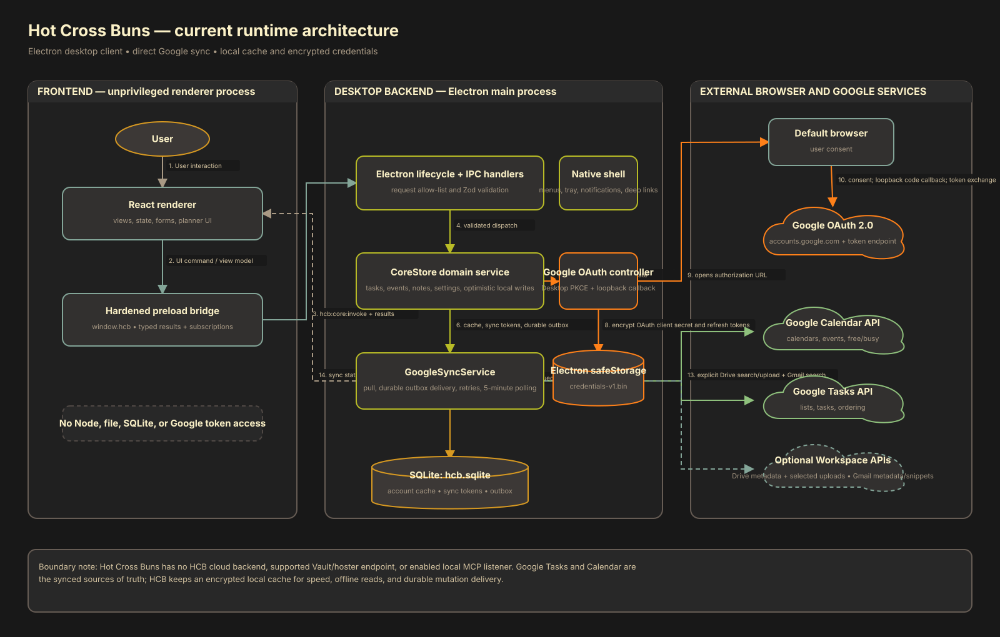
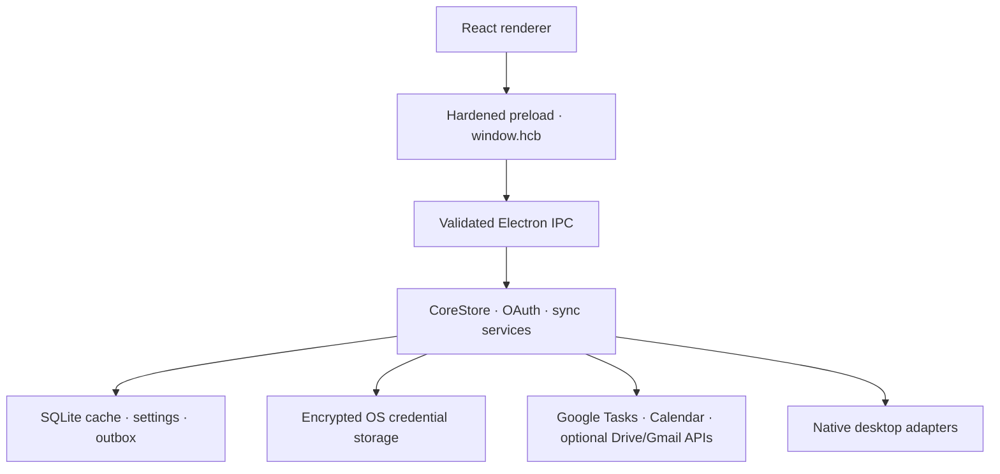

<p align="center">
  <a href="https://github.com/gongahkia/hot-cross-buns">
    
  </a>
</p>

<h1 align="center"><code>Hot Cross Buns</code></h1>

<h3 align="center">A keyboard-first Electron desktop planner for Google Tasks, Google Calendar, and local notes.</h3>

<p align="center">
  <a href="#local-development">Get started</a> ·
  <a href="docs/README.md">Docs</a> ·
  <a href="docs/architecture/system-architecture.md">Architecture</a> ·
  <a href="docs/security/privacy-and-threat-model.md">Privacy &amp; security</a>
</p>

<p align="center">
  
  
  
  
</p>

> [!IMPORTANT]
> Hot Cross Buns is a local desktop app. Google Tasks and Google Calendar are authoritative for synced data; SQLite is a local cache, settings store, and durable outbox. HCB has no cloud backend, Vault/hoster endpoint, or enabled local MCP listener.

## Table of Contents

- [Highlights](#highlights)
- [Install](#install)
- [Architecture](#architecture)
- [Repository Layout](#repository-layout)
- [Local Development](#local-development)
- [Release Checks](#release-checks)
- [Testing](#testing)
- [Additional Documentation](#additional-documentation)

## Highlights

Hot Cross Buns keeps planning close to the keyboard while safely separating the React UI from desktop and Google privileges.

- Google Tasks: task lists, subtasks, completion, dates, priorities, planning fields, reordering, and same-account moves
- Google Calendar: agenda, day, week, and month views; events, recurrence, task blocks, availability, Meet links, RSVP, free/busy, and Google status events
- Local notes, tags, full-text search, command palette, quick capture, undo/redo, and split-pane workspaces
- Multiple Google accounts with account-scoped caches, incremental sync, retry/backoff, and a durable offline-mutation outbox
- Settings for accounts, sync, appearance, themes, hotkeys, notifications, diagnostics, and native capabilities
- Fifty curated colour schemes, custom-background inference, and loading indicators that respect reduced-motion preferences
- Optional Google Workspace access after explicit authorization: Drive metadata/linking plus selected-file private upload, and Gmail metadata/snippet search with email-to-task capture
- macOS app menu, menu-bar/tray, quick-capture shortcut, notifications, and deep links; Linux and Windows adapters report source-build capabilities and limitations

The renderer is unprivileged: filesystem, SQLite, credential, OAuth, Google, and native work stays behind the hardened preload bridge and validated IPC handlers.

## Install

This repository is intended for local development and preview validation. A signed public installer is not currently available.

**Requirements**

- Node.js 20 or newer
- Corepack and pnpm 9.15.4

**Install and run**

```bash
corepack enable
corepack pnpm install
corepack pnpm dev
```

The development command starts the Vite renderer and Electron app. Stop it with `Ctrl+C` in the terminal.

**Google setup**

Configure a Desktop OAuth client through onboarding or Settings, then complete browser consent. Use your own Google Cloud project and never commit, paste, or log OAuth client secrets, access tokens, refresh tokens, passwords, or browser cookies. Optional Drive and Gmail access is separately authorized and reconfigurable in Settings.

## Architecture

[](docs/architecture/hot-cross-buns-current-architecture.drawio)


```mermaid
flowchart TD
    renderer["React renderer"] --> preload["Hardened preload · window.hcb"]
    preload --> ipc["Validated Electron IPC"]
    ipc --> services["CoreStore · OAuth · sync services"]
    services --> sqlite["SQLite cache · settings · outbox"]
    services --> credentials["Encrypted OS credential storage"]
    services --> google["Google Tasks · Calendar · optional Drive/Gmail APIs"]
    services --> native["Native desktop adapters"]
```

Credentials, local files, databases, and Google calls never enter the renderer. See the [architecture model](docs/architecture/hot-cross-buns-architecture.json) and [diagram workflow](docs/architecture/diagram-workflow.md) before changing a boundary or integration.

## Repository Layout

```text
assets/logo/       Canonical bread logo used by the renderer
docs/              Product, architecture, platform, security, testing, and release docs
src/main/          Electron lifecycle, validated IPC, CoreStore, OAuth, sync, and native adapters
src/preload/       Narrow, typed renderer-to-main bridge
src/renderer/      React UI, view models, and feature components
src/shared/        Shared contracts, schemas, results, and utilities
scripts/           Architecture generation, database tests, and performance helpers
```

Start with [docs/README.md](docs/README.md), then read the owning subsystem documentation before changing behaviour.

## Local Development

**Useful commands**

```bash
corepack pnpm dev
corepack pnpm build
corepack pnpm test:unit
corepack pnpm test:db
corepack pnpm test:security
```

`build` verifies checked-in architecture artifacts, performs both TypeScript checks, and bundles the Electron main process, preload bridge, and renderer.

**Platform status**

- macOS is the core native target.
- Linux is a technical preview with desktop-environment-specific limitations.
- Windows is a technical preview requiring installed-build manual validation before support claims.

Read the [cross-platform strategy](docs/ports/cross-platform-porting.md), [Linux port guide](docs/ports/linux-port.md), and [Windows port guide](docs/ports/windows-port.md) before platform-specific work.

## Release Checks

Run the narrowest relevant checks while developing. Before a release candidate, run the full local gate:

```bash
corepack pnpm test:release-gate
```

The gate runs the build, unit suite, SQLite suite, and Electron launch smoke test. It intentionally excludes live-Google mutations, performance smoke suites, signing, notarization, and publishing. Preview-distribution and manual-platform requirements are documented in [Distribution](docs/release/distribution.md).

## Testing

The test surface includes:

- unit tests for renderer logic, preload validation, shared contracts, and main-process services
- Electron-runtime SQLite tests for migrations, sync state, task blocks, undo/redo, and scheduling flows
- mocked Google transport tests and Playwright Electron launch smoke coverage
- optional scale/performance commands for 1,000, 5,000, and 10,000 task-and-event fixtures

Live Google testing is opt-in and never runs by default. Personal accounts are read-only; mutation testing requires a designated disposable account, dedicated resources, and the documented acknowledgement. See [Live Google testing](docs/live-google-testing.md).

## Additional Documentation

- [Documentation index](docs/README.md)
- [Product requirements](docs/product/prd.md)
- [System architecture](docs/architecture/system-architecture.md)
- [Tech stack ADR](docs/architecture/tech-stack.md)
- [Google sync specification](docs/specs/google-sync.md)
- [Local data specification](docs/specs/local-data.md)
- [Native parity](docs/specs/native-parity.md)
- [Google Workspace integrations](docs/google-workspace-integrations.md)
- [Privacy and threat model](docs/security/privacy-and-threat-model.md)
- [QA plan](docs/testing/qa-plan.md)
